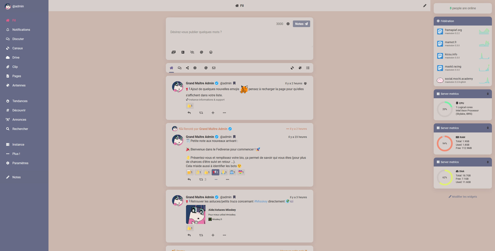

# Sable • Theme for [Misskey](https://github.com/syuilo/Misskey)

Light Theme for Misskey.



# Use

Copy this code in Misskey

```
{
	id: '9ag418hd-6i7c-4fh7-b5c4-w9b2kjh2612a',

	name: 'Sable',
	author: '@kazukyakayashi@meow.zarchbox.fr',
	desc: 'Light theme',

	base: 'light',

	props: {
		accent: '#666a86',
		bg: '#ccb7ae',
		fg: '#323031',
		fgHighlighted: '@link',
		indicator: '#ff578b',
		panel: '#d6cfcb',
		panelHighlight: '#000000',
		panelHeaderBg: '#666a86',
		panelHeaderFg: '#fefefe',
		panelHeaderDivider: '#d6cfcb',
		navBg: '#666a86',
		navFg: 'fefefe',
		navHoverFg: '#ff578b',
		navActive: '#ff578b',
		navIndicator: '#ff578b',
		header: '#d6cfcb',
		link: '#5e548e',
		mention: '#ca8468',
		hashtag: '#6290c8',
		renote: '#ca8468',
		cwBg: '#5e548e',
		cwHoverBg: '#4a4270',
		pageBg: '@panel',
		badge: '#565264',
		divider: 'transparent',
		driveFolderBg: '@panel',
	},
}
```
